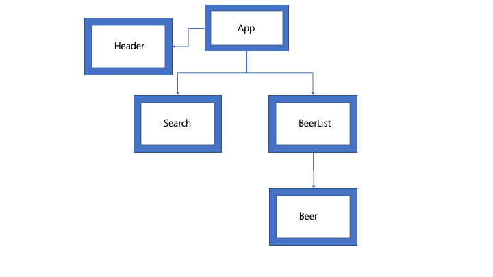

## Project Description
1) Name of Project: Brewvana, web dictionary of beer industry

2) Project’s Purpose or Goal: User can navigate the information about beer from API in single-page webapp environment.

3) List the absolute minimum features the project requires to meet this purpose or goal:

4) User can search/select beer by ABV or IBU or Hop, malt, yeast and etc....

5) User can see the details of each beer based on API information including image and short description.

6) PUNK API (https://punkapi.com/documentation/v2), React.js, HTML5/CSS/JavaScript, Chart.js, Python for web crawler
To make sure everyone can access the API reliably, each IP that makes a request has a rate limit of 3600 requests per hour.

This works out at 1 req/sec. This is an initial figure, if the servers hold up I will definitely consider bumping this number. You can see what the rate limit is and how many requests are remaining by looking at the rate limit headers sent in the response.

7) Chart for ABV/IBU of every beer in API

8) Interface with WebCrawler for each beer using python (https://towardsdatascience.com/data-science-skills-web-scraping-javascript-using-python-97a29738353f)

## Component and Route Structure

## Thinking in React (https://reactjs.org/docs/thinking-in-react.html)

This project was bootstrapped with [Create React App](https://github.com/facebook/create-react-app).

## About API
Full list in BreweryDB

query in postman with API key --> https://sandbox-api.brewerydb.com/v2/beers?key=55ea04b68426cd94bea8574c113936c8

for page 1, https://sandbox-api.brewerydb.com/v2/beers?key=55ea04b68426cd94bea8574c113936c8&p=1
for page 2, https://sandbox-api.brewerydb.com/v2/beers?key=55ea04b68426cd94bea8574c113936c8&p=2
...

## Available Scripts

In the project directory, you can run:

### `npm start`

Runs the app in the development mode. 
Open [http://localhost:3000](http://localhost:3000) to view it in the browser.

The page will reload if you make edits. 
You will also see any lint errors in the console.

### `npm run build`

Builds the app for production to the `build` folder. 
It correctly bundles React in production mode and optimizes the build for the best performance.

The build is minified and the filenames include the hashes. 
Your app is ready to be deployed!

See the section about [deployment](https://facebook.github.io/create-react-app/docs/deployment) for more information.

### Deployment

This section has moved here: https://facebook.github.io/create-react-app/docs/deployment

### `npm run build` fails to minify

This section has moved here: https://facebook.github.io/create-react-app/docs/troubleshooting#npm-run-build-fails-to-minify
